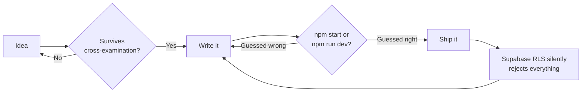

<h1>Smit Bharat Patil</h1>

  
  

  
  
  

 

> **REF. 01 · OPENING NOTE**

My internship at Horizontal closed out. What's posted since: I'm **CTO at Clipency**, and a **web developer at NexElite**, a creative media agency.

At Clipency that means owning the actual system - the creator marketplace, the finance tracker behind it, the parts that quietly cannot break while someone's waiting on a payout. At NexElite it means building brand-first sites for clients, the kind where the hover state was never optional.

Somewhere in the cracks, **Ekam Finance** is still my longest-running side project (and my longest-running `npm start` vs `npm run dev` incident report), and I'm currently deep in rebuilding NexElite's own site and shipping the web build for **Narva** (narva.in).

 

> **REF. 02 · ACCOUNT SUMMARY**

| entry | role | status |
|---|---|---|
| **Clipency** | Chief Technology Officer | `ACTIVE` |
| **NexElite** | Web Developer | `ACTIVE` |
| **Horizontal** | Full-Stack Intern | `CLOSED` |

 

> **REF. 03 · TRANSACTION LOG**

| project | what it actually is | stack | status |
|---|---|---|---|
| **[Clipency](https://clipency.in)** | the creator marketplace I run engineering for - paid per clip, not per vibe | Next.js, Supabase, Vercel | `ACTIVE` |
| **[Clipency Finance](https://finance.clipency.in)** | the internal tracker keeping Clipency's own books honest | Next.js, Supabase | `ACTIVE` |
| **[Ekam Finance](https://ekam-finance.vercel.app)** | personal finance, built INR-first - not a US budgeting app with a rupee symbol bolted on | Next.js 15, Supabase, TypeScript | `ONGOING` |
| **[Narva](https://narva.in)** | brand + web build for a health-forward company | Next.js, GSAP | `IN PROGRESS` |
| **NexElite** | the agency's own site - built by the person who builds everyone else's | Next.js, GSAP, Framer Motion, Lenis | `IN PROGRESS` |

 

> **REF. 04 · ASSETS ON HAND**

 

> **REF. 05 · HOW A LINE ITEM GETS POSTED**

 

> **REF. 06 · CROSS-EXAMINATION**

**A fintech CTO who also builds brand sites for a media agency - pick a lane.**
The lane is systems that have to hold up under pressure. Money and brand promises fail the same way: quietly, then all at once.

**You track UPSC cutoffs but you're not appearing for the exam.**
Same reason people watch chess they'll never play at that level. The mechanism is the interesting part, not the outcome.

**Debate and writing code have nothing to do with each other.**
Same skill, different targets - construct a claim, stress-test it under hostile questions, ship the version that survives.

**Do you ever actually sleep?**
See: DEBIT column, above.

 

> **REF. 07 · AUDIT TRAIL**

 

---

<b>CLOSING BALANCE</b> <i>Open to talking product, debate, or why your Supabase RLS policy is silently failing. It is usually the policy, not you.</i>

<i>&mdash; S.B.P.</i>

