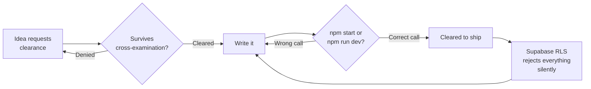

  
  
  

  
  
  

  
  
  
  
  
  

 

## FADE IN:

### INT. TOWER, PRESENT DAY

Three roles running at once. One degree finishing at IIT Madras while another runs concurrently at KIIT. The console reads clear on all of it.

**Co-Founder and Chief Technology Officer at [Quero](https://smit.website).** The logline: *the computer-based testing platform built for India's toughest entrance exams.* NEET, JEE, CUET, the state CETs, GATE, UPSC CSE, all of it. NTA-style testing that behaves like the real exam, not a rehearsal for it. Retests generated from a student's own mistake history instead of a random question bank. Institute dashboards built for people running six branches, not one classroom. Offline-first, because the connectivity at most exam centers in this country is a plot twist nobody asked for. This repository's sibling, the internal ops portal, is where the daily build log actually lives.

**Cut to NexElite.** Web developer, still the kind of build where nobody skipped the hover state. The agency's own site is *"built to the standard real clients deserve,"* which is a harder bar to clear when you're the client.

**Cut to Infiltrix.** IT consultant. **Cut to Kacheri Diaries LLP.** Senior Community Manager, East India, since July 2025.

**And Clipency.** *"Where viral content finds scale."* A creator marketplace with a finance tracker running underneath it, needing to hold up at the exact second someone's waiting on a payout. Parked between builds right now. Not dead. Planes get parked too.

Five shipped products. Seven roles held. Two degrees in progress, at the same time, on purpose. Ekam Finance remains the longest-running fight of my life against `npm start` versus `npm run dev`, and the semester lab work stays public so anyone can point straight at a specific solution instead of asking twice.

 

## CUT TO: ACTIVE FLIGHTS

| callsign | role | since | status |
|---|---|---|---|
| **Quero** | Co-Founder and Chief Technology Officer | Aug 2026 | `IN THE AIR` |
| **NexElite** | Web Developer | ongoing | `IN THE AIR` |
| **Kacheri Diaries LLP** | Sr. Community Manager, East India | Jul 2025 | `IN THE AIR` |
| **Infiltrix** | IT Consultant | Apr 2026 | `IN THE AIR` |
| **Clipency** | Chief Technology Officer | ongoing | `ON THE GROUND` |
| **Horizontal Digital** | Full-Stack Intern, DX | Apr to Jul 2026 | `LANDED` |
| **KIIT Saathi** | Growth Manager | Oct 2025 to Mar 2026 | `LANDED` |
| **USHM Essence** | Chief Marketing Officer | Nov 2024 to Jun 2025 | `LANDED` |

 

## SCENE: THE LOGLINES

Every screenwriter learns this first. If you cannot pitch it in one line, you do not understand it yet. Here is every project, reduced to the one line each earned.

| project | logline | stack | status |
|---|---|---|---|
| **Quero** | The computer-based testing platform built for India's toughest entrance exams | Next.js, React, Supabase, Three.js/R3F | `IN THE AIR` |
| **[Ekam Finance](https://ekam-finance.vercel.app)** | Personal finance, made legible | Next.js 15, React 19, Supabase, Three.js | `IN THE AIR` |
| **[NexElite](https://github.com/sbktckp/NexElite)** | An agency site built to the standard real clients deserve | Next.js 16, React 19, GSAP, Lenis, Tailwind v4 | `FINAL APPROACH` |
| **Clipency** | Where viral content finds scale | Next.js, Supabase | `ON THE GROUND` |
| **[Narva](https://narva.in)** | A digital storefront for a doctor-led sleep wellness brand | Next.js, GSAP | `LANDED` |

 

## GROUND SCHOOL

Two degrees, run concurrently, because scheduling conflicts build character.

| programme | institute | years |
|---|---|---|
| B.Tech, Computer Science and Engineering | KIIT | 2024 to 2028 |
| BS, Data Science and Applications | IIT Madras | 2024 to 2028 |

Semester lab work, kept public so there is one place to point someone at a specific solution instead of rewriting it from memory.

| repo | course | what's in it |
|---|---|---|
| **[Design and Analysis of Algorithms](https://github.com/sbktckp/Design-and-Analysis-of-Algorithms)** | Algorithms Laboratory | ten lab days in C17, every program written twice: full, and short enough for a record book |
| **[Computer Networks](https://github.com/sbktckp/Computer-Networks)** | Computer Networks Laboratory | endianness, TCP sockets, client server pairs, same full and compact split |

 

## INSTRUMENTS

 

## STANDARD APPROACH PATTERN

 

## RADIO CHECK

<b>Weren't you CTO at Clipency last year, and now it's Quero?</b>

 
Clipency is parked, not crashed. Quero is the runway getting the fuel right now: an actual exam-prep platform students in tier-2 and tier-3 India can trust to hold up on exam day, not a demo that only works for the person who built it.

<b>Two computer-science-adjacent degrees, running at the same time. Why?</b>

 
KIIT teaches the engineering. IIT Madras teaches the math the engineering quietly depends on. Running both at once was the only way I found to stop treating one as decoration for the other.

<b>Five products, seven roles, two degrees. That is not a typo?</b>

 
It is not. It is also not a flex. It is what happens when you refuse to let any one runway close before the next one opens. Some of those rows say `LANDED` for a reason.

<b>A fintech-turned-edtech CTO who also builds brand sites for a media agency. Pick one runway.</b>

 
Same runway, different tail numbers. Money, exams, and brand promises all fail the same way. Quiet first, then all at once. Working across all of them just means I catch the quiet part earlier.

<b>You track UPSC cutoffs without appearing for the exam.</b>

 
Same reason people watch air traffic without holding a license. The system interests me more than the seat does. It also happens to be exactly the system Quero now exists to help people beat.

<b>Do you ever land?</b>

 
Sometimes. Narva did. Check the <code>LANDED</code> rows for the rest. Everything not marked landed is still climbing.

 

## INT. BLACK BOX, RECOVERED

  

<i>a year of commits, extruded into a runway you can actually look down at</i>
 

  

<i>the same year, flattened back into something that eats</i>
 

 

## FADE OUT.

<b>CLEARED FOR CONTACT</b> <i>Open to talking product, exam-prep at scale, screenwriting theory applied to READMEs, or why your Supabase RLS policy is silently rejecting everything. It is usually the policy, not you.</i>

  <a href="https://x.com/sbktckp">X</a> &nbsp;·&nbsp;
  <a href="https://www.instagram.com/sbktckp">Instagram</a> &nbsp;·&nbsp;
  <a href="https://www.threads.com/@sbktckp">Threads</a> &nbsp;·&nbsp;
  <a href="https://smit.website">smit.website</a>

<i>S.B.P.</i>

