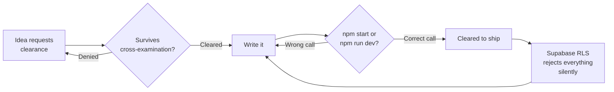

<h1>✈ SMIT BHARAT PATIL</h1>

<i>flight log, what's currently airborne</i>

  
  

  
  
  

 

> **TOWER LOG, CURRENT POSITION**

Horizontal wrapped up a while back. Right now I'm CTO at Clipency and a web developer at NexElite, a creative media agency.

Clipency means owning the actual system: a creator marketplace plus the finance tracker running underneath it, both of which need to hold up at the exact moment someone's waiting on a payout. NexElite means brand-first sites, the kind where nobody skipped the hover state.

Ekam Finance is still my longest-running personal project, and honestly the longest-running fight I've had with `npm start` vs `npm run dev`. Right now I'm also rebuilding NexElite's own site and shipping the web build for Narva (narva.in).

 

> **ACTIVE FLIGHTS**

| callsign | role | status |
|---|---|---|
| **Clipency** | Chief Technology Officer | `IN THE AIR` |
| **NexElite** | Web Developer | `IN THE AIR` |
| **Horizontal** | Full-Stack Intern | `LANDED` |

 

> **FLIGHT PLANS**

| project | what it actually is | stack | status |
|---|---|---|---|
| **[Ekam Finance](https://ekam-finance.vercel.app)** | personal finance, built INR first, not a US app with a rupee symbol taped on | Next.js 15, Supabase, TypeScript | `HOLDING PATTERN` |
| **[Narva](https://narva.in)** | brand and web build for a health-forward company | Next.js, GSAP | `APPROACH` |
| **NexElite** | the agency's own site, built by the guy who builds everyone else's | Next.js, GSAP, Framer Motion, Lenis | `APPROACH` |

 

> **INSTRUMENTS**

 

> **STANDARD APPROACH PATTERN**

 

> **RADIO CHECK**

**A fintech CTO who also builds brand sites for a media agency, pick one runway.**
It's the same runway with different tail numbers. Money and brand promises fail the same way, quietly at first, then all at once. Working across both just means I catch the quiet part earlier.

**You track UPSC cutoffs without appearing for the exam.**
Same reason people watch air traffic without holding a license. I find the system more interesting than the seat.

**Debate and writing code have nothing in common.**
They're closer than they look. Build a claim, put it through hostile questioning, ship only what survives that.

**Do you ever land?**
Working on it. Check the `IN THE AIR` column above.

 

> **BLACK BOX**

 

---

<b>CLEARED FOR CONTACT</b> <i>Open to talking product, debate, or why your Supabase RLS policy is silently rejecting everything. It's usually the policy, not you.</i>

<i>&mdash; S.B.P.</i>

