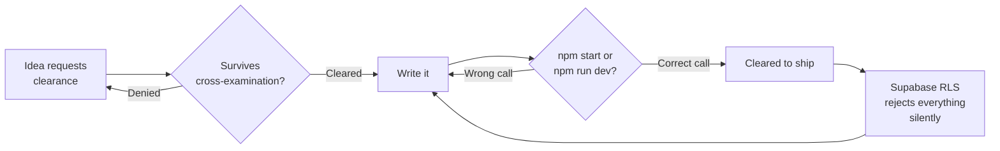

  
  
  

  
  
  
  

 

> **TOWER LOG, CURRENT POSITION**

Co-Founder and CTO at **[Quero](https://smit.website)** now, which is the main runway: an AI-powered exam-prep platform for India's toughest entrance exams, NEET through UPSC CSE. NTA-style computer-based testing, AI-generated retests built from a student's own mistake history, institute dashboards for multi-branch management, and offline-first so it keeps working through the connectivity most exam centers actually have. This README's own sibling — the internal team ops portal — is where the daily grind of building it lives.

Alongside that: web developer at **NexElite**, a creative media agency, still the kind of build where nobody skipped the hover state. IT consultant at **Infiltrix**, and Senior Community Manager for East India at **Kacheri Diaries**. Clipency — creator marketplace plus the finance tracker underneath it — is parked between builds, not dead.

Running two degrees at once because one wasn't enough noise: **B.Tech CSE at KIIT** and **BS Data Science & Applications at IIT Madras**, both 2024–2028. Ekam Finance is still the longest-running fight I've had with `npm start` vs `npm run dev`, and the semester lab work lives here in public for anyone who needs to point at a specific solution.

 

> **ACTIVE FLIGHTS**

| callsign | role | since | status |
|---|---|---|---|
| **Quero** | Co-Founder & Chief Technology Officer | Aug 2026 | `IN THE AIR` |
| **NexElite** | Web Developer | — | `IN THE AIR` |
| **Kacheri Diaries LLP** | Sr. Community Manager, East India | Jul 2025 | `IN THE AIR` |
| **Infiltrix** | IT Consultant | Apr 2026 | `IN THE AIR` |
| **Clipency** | Chief Technology Officer | — | `ON THE GROUND` |
| **Horizontal Digital** | Full-Stack Intern (DX) | Apr – Jul 2026 | `LANDED` |
| **KIIT Saathi** | Growth Manager | Oct 2025 – Mar 2026 | `LANDED` |
| **USHM Essence** | Chief Marketing Officer | Nov 2024 – Jun 2025 | `LANDED` |

 

> **FLIGHT PLANS**

| project | what it actually is | stack | status |
|---|---|---|---|
| **Quero** | AI-powered exam prep for NEET/JEE/CUET/state CETs/GATE/UPSC, built like an actual testing platform, not a quiz app | Next.js, React, Supabase, Three.js/R3F | `IN THE AIR` |
| **[Ekam Finance](https://ekam-finance.vercel.app)** | personal finance, built INR first, not a US app with a rupee symbol taped on | Next.js 15, React 19, Supabase, Three.js | `IN THE AIR` |
| **[NexElite](https://github.com/sbktckp/NexElite)** | the agency's own site, built by the guy who builds everyone else's | Next.js 16, React 19, GSAP, Lenis, Tailwind v4 | `FINAL APPROACH` |
| **[Narva](https://narva.in)** | brand and web build for a health-forward company | Next.js, GSAP | `LANDED` |

 

> **GROUND SCHOOL**

Two degrees, run concurrently, because scheduling conflicts build character.

| programme | institute | years |
|---|---|---|
| B.Tech, Computer Science & Engineering | KIIT | 2024 – 2028 |
| BS, Data Science & Applications | IIT Madras | 2024 – 2028 |

Semester lab work, kept public so there's one place to point someone at a specific solution.

| repo | course | what's in it |
|---|---|---|
| **[Design and Analysis of Algorithms](https://github.com/sbktckp/Design-and-Analysis-of-Algorithms)** | Algorithms Laboratory | ten lab days in C17, every program written twice: full, and short enough for a record book |
| **[Computer Networks](https://github.com/sbktckp/Computer-Networks)** | Computer Networks Laboratory | endianness, TCP sockets, client server pairs, same full and compact split |

 

> **INSTRUMENTS**

 

> **STANDARD APPROACH PATTERN**

 

> **RADIO CHECK**

**Weren't you CTO at Clipency last year, and now it's Quero?**
Clipency's parked, not crashed. Quero is the runway getting the fuel right now — an actual exam-prep platform students in tier-2/3 India can trust to hold up on exam day, not a demo.

**Two computer science-adjacent degrees, at once. Why?**
KIIT teaches the engineering. IIT Madras teaches the math the engineering quietly depends on. Running both is the only way I found to stop treating one as decoration for the other.

**A fintech-turned-edtech CTO who also builds brand sites for a media agency, pick one runway.**
It's the same runway with different tail numbers. Money, exams, and brand promises all fail the same way — quietly at first, then all at once. Working across them just means I catch the quiet part earlier.

**You track UPSC cutoffs without appearing for the exam.**
Same reason people watch air traffic without holding a license. I find the system more interesting than the seat. It also happens to be exactly the system Quero is now built to prep people for.

**Do you ever land?**
Sometimes. Narva did. Check the `LANDED` rows for the rest — everything else is still climbing.

 

> **BLACK BOX**

 

  

<i>a year of commits, extruded into a runway you can actually look down at</i>
 

  

 

<b>CLEARED FOR CONTACT</b> <i>Open to talking product, exam-prep at scale, debate, or why your Supabase RLS policy is silently rejecting everything. It's usually the policy, not you.</i>

<i>S.B.P.</i>

